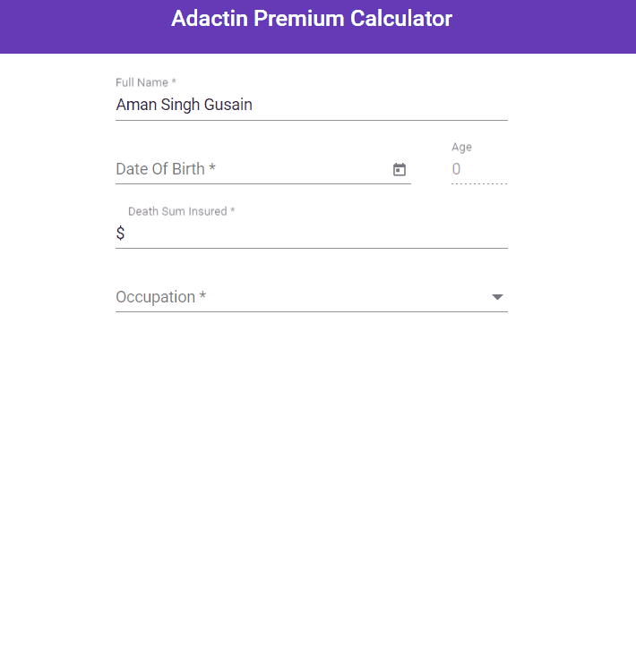

# Adactin Insurance Premium Calculator App

This repository contains code for front-end and back-end of premium calculator app.


## Applications
* Front-end: Angular 13
* Back-end: .Net Core 6


## Demo


## Calculate death premium (HTTP POST)

``` https://localhost:7254/api/premium/calculate ```

```javascript
  {
    "fullName": "string",
    "age": 0,
    "occupationId": 0,
    "deathSumAssured": 0
  }
```

